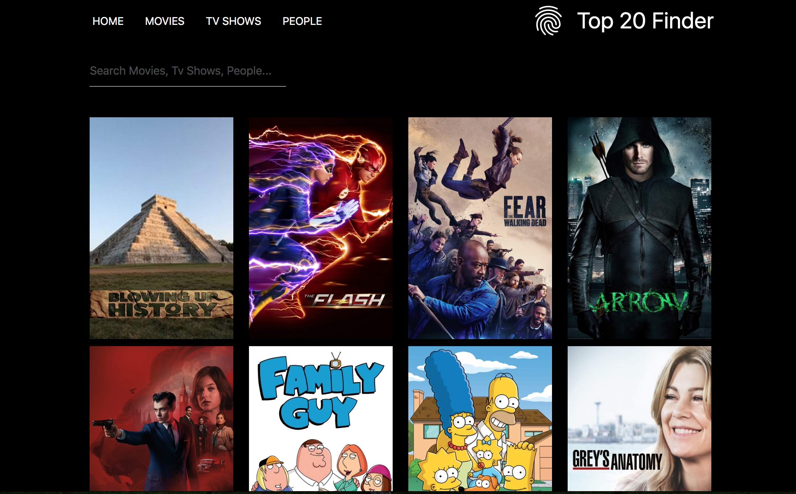

Top 20 Finder for Movies/ Tv Shows/ People
==========================================




# Frontend Task for Brandwidth


Create an application using a framework of your choice that will display the top 20
most popular Movies, TV shows and People using The Movie DB API.


These should be split into separate categories that you can switch between;
- Movies
- TV Shows
- People


When you click on an item, open a modal to show details related to that item.


## To run the project locally
#### You’ll need to have Node 8.16.0 or Node 10.16.0 or later version on your local development machine

- Press the Green button that says Clone or Download, on the top right corner

- then either clone with SSH, like so
```git clone git@github.com:tsubashii/top-20-finder.git```

- or clone with HTTPS, like so
```https://github.com/tsubashii/top-20-finder.git```

- or you can even download the file as a zip.

- then go into the project,
``` cd top-20-finder ```

- locate the file name .env.example, and rename it to .env

- if there isn't a .env file, then create one

- inside the .env file you will 
``` REACT_APP_TOP_TWENTY_FINDER_API_KEY=mySecretKey ```

- replace ``` mySecretKey ``` with Your movie db API Key. (if you don't have one, you can get it here https://www.themoviedb.org/documentation/api)

-  then run this command on the terminal 
``` npm install ```

- then run
``` npm start ```


### Next Steps

- Add a feature to enable live search within a category.
> Currently search is partially implemented on people(component), where api makes a get request(eg: John), which returns an object on the console, that has anything to do with John in movies/tvshows.

- Implement some test cases using Jest.
